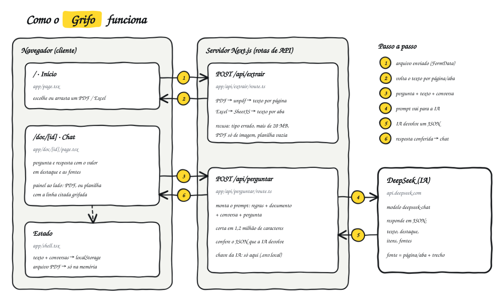

# Grifo

Envie um PDF ou uma planilha Excel e pergunte o que quiser saber. O Grifo lê o arquivo, responde em português e mostra de onde tirou a resposta.

> Exemplo: você envia `pagamentos-marco.pdf`, pergunta "qual foi o total gasto?" e recebe o valor em destaque, o detalhamento e a página onde ele aparece.

## O que faz

- **PDF e Excel** (`.pdf`, `.xlsx`, `.xls`), enviados por clique ou arrastando.
- **Chat sobre o documento**: a resposta vem com o valor principal em destaque, um detalhamento quando faz sentido e as fontes (página do PDF ou aba da planilha, com o trecho citado).
- **Não inventa**: se a informação não está no arquivo, a resposta diz isso.
- **Painel do documento**: o PDF ou a planilha ficam ao lado do chat no desktop e em tela cheia no celular. Na planilha, a linha citada aparece grifada.
- **Recentes**: documentos e conversas ficam salvos no navegador.

## Como funciona



1. O navegador envia o arquivo para `POST /api/extrair`.
2. O servidor devolve o texto separado por página (PDF) ou por aba (Excel). O navegador guarda esse texto.
3. A cada pergunta, o navegador envia para `POST /api/perguntar` o texto do documento, a conversa até ali e a pergunta.
4. O servidor monta o prompt e chama a DeepSeek.
5. A IA devolve um JSON com `texto`, `destaque`, `itens` e `fontes`.
6. O servidor confere o formato desse JSON e devolve a resposta, que aparece no chat.

A chave da IA fica só no servidor e nunca chega ao navegador.

### Rotas

| Rota | Arquivo | O que faz |
| --- | --- | --- |
| `/` | `app/page.tsx` | Início: envio do arquivo e lista de recentes |
| `/doc/[id]` | `app/doc/[id]/page.tsx` | Primeira pergunta, chat e painel do documento |
| `POST /api/extrair` | `app/api/extrair/route.ts` | Extrai o texto do PDF ([unpdf](https://github.com/unjs/unpdf)) ou da planilha ([SheetJS](https://sheetjs.com)) |
| `POST /api/perguntar` | `app/api/perguntar/route.ts` | Monta o prompt, chama a DeepSeek e valida a resposta |

### Formato da resposta da IA

```json
{
  "texto": "O total gasto em março foi de",
  "destaque": "R$ 4.218,90",
  "itens": [{ "rotulo": "Aluguel", "valor": "R$ 2.100,00" }],
  "fontes": [{ "pagina": 2, "trecho": "Total geral R$ 4.218,90" }]
}
```

Só `texto` é obrigatório. Em planilhas, `pagina` é o número da aba.

## Como rodar

Requisitos: Node.js 20 ou mais recente e uma chave de API da [DeepSeek](https://platform.deepseek.com).

```bash
npm install
```

Crie um arquivo `.env.local` na raiz do projeto:

```
DEEPSEEK_API_KEY=sua-chave-aqui
```

Depois:

```bash
npm run dev
```

Abra http://localhost:3000.

O `.env.local` está no `.gitignore`: a chave não vai para o repositório.

## Estrutura

```
app/
  layout.tsx            fontes e estrutura da página
  shell.tsx             estado do app (documentos, conversas) e barra lateral
  page.tsx              Início
  globals.css           estilos (celular e desktop)
  doc/[id]/page.tsx     primeira pergunta, chat e painel do documento
  api/extrair/route.ts  arquivo → texto por página ou aba
  api/perguntar/route.ts  pergunta → DeepSeek → resposta validada
lib/
  responder.ts          tipos da resposta e chamada à rota /api/perguntar
  calculo.ts            contas exatas sobre a planilha (soma, contagem, média...)
  calculo.test.mjs      verificação das contas: node lib/calculo.test.mjs
docs/
  arquitetura.svg       desenho acima
```

## Limites conhecidos

- **PDF digitalizado** (só imagem) é recusado: não há OCR.
- **Tamanho**: arquivos de até 20 MB. O texto enviado à IA é cortado em 1,2 milhão de caracteres, o que dá por volta de 2.000 linhas de uma planilha larga.
- **Custo**: o documento inteiro é reenviado a cada pergunta. Documentos grandes consomem muitos tokens.
- **Contas em planilhas**: soma, contagem, média, máximo e mínimo são calculados no servidor (`lib/calculo.ts`); a IA só descreve a conta (aba, coluna, filtros). Isso exige que a primeira linha da aba seja o cabeçalho. Contas mais elaboradas, como comparar duas colunas, ainda ficam por conta do modelo.
- **Trecho no PDF**: o PDF abre no visualizador do navegador, que não grifa o trecho dentro da página (ele aparece num cartão abaixo). No Chrome do Android o PDF abre em outra aba.
- **Depois de recarregar a página**: a conversa e as planilhas continuam; o arquivo PDF precisa ser enviado de novo para ser visualizado.
- **Sem login**: as rotas de API são abertas. Antes de publicar na internet, proteja-as para ninguém gastar a sua chave.

## Tecnologias

Next.js 16 (App Router), React 19, TypeScript, CSS puro, unpdf, SheetJS e a API da DeepSeek.
